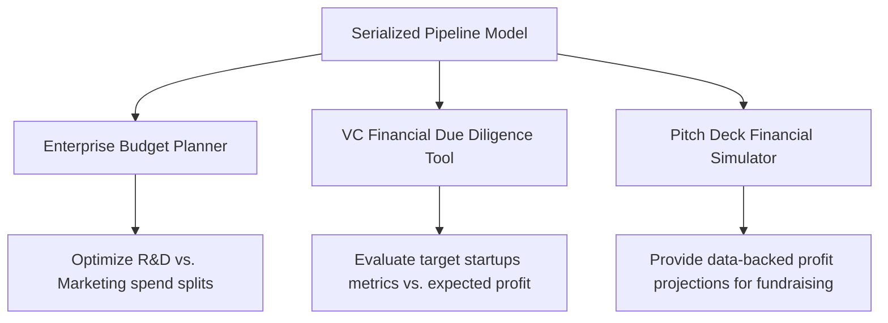

# Kaggle 50 Startups Profit Prediction  
## Using CRISP-DM Methodology and Scikit-learn

---

## 1. Introduction

In today's competitive business environment, startup companies need to allocate their financial resources effectively to maximize profitability. Understanding how different types of spending influence company profit is valuable for entrepreneurs, investors, and business managers.

This project uses the **Kaggle 50 Startups Dataset** to analyze startup spending patterns and build a machine learning model to predict company profit.

The dataset contains financial information from 50 startup companies, including:

- R&D Spend
- Administration
- Marketing Spend
- State
- Profit

The project follows the **CRISP-DM** methodology, which includes six phases:

1. Business Understanding
2. Data Understanding
3. Data Preparation
4. Modeling
5. Evaluation
6. Deployment

---

# Phase 1: Business Understanding

## 1.1 Business Problem

Startup companies often have limited financial resources. Therefore, they need to understand which spending categories contribute most to profit growth.

The main business problem is:

> How can we predict startup profit based on spending patterns and company location?

The goal is to help decision-makers understand whether R&D, marketing, administration, or state location plays a significant role in profit generation.

---

## 1.2 Business Objectives

The main objectives of this project are:

1. Identify the most important factors affecting startup profit.
2. Analyze the relationship between spending categories and profit.
3. Build a regression model to predict profit.
4. Compare different feature combinations.
5. Provide business insights for budget allocation.

---

## 1.3 Data Mining Goal

This is a supervised learning regression problem.

### Input Features

| Feature | Description | Type |
|---|---|---|
| R&D Spend | Research and development spending | Numerical |
| Administration | Administrative cost | Numerical |
| Marketing Spend | Marketing cost | Numerical |
| State | Startup location | Categorical |

### Target Variable

| Target | Description |
|---|---|
| Profit | Company profit |

---

## 1.4 Success Criteria

### Business Success Criteria

The project is successful if it can:

- Identify the key drivers of profit.
- Explain which spending category has the strongest impact.
- Provide useful recommendations for startup budget allocation.

### Technical Success Criteria

The model is considered successful if it achieves:

- High R² Score
- Low MAE
- Low RMSE
- Stable performance across different feature sets

---

# Phase 2: Data Understanding

## 2.1 Dataset Overview

The dataset contains 50 startup records and 5 columns.

```python
import pandas as pd

df = pd.read_csv("50_Startups.csv")

print(df.head())
print(df.info())
print(df.describe())
```

### 2.1.1 Data Inspection Output

#### First 5 Rows of the Dataset (`df.head()`)
| R&D Spend | Administration | Marketing Spend | State | Profit |
|---|---|---|---|---|
| 165349.20 | 136897.80 | 471784.10 | New York | 192261.83 |
| 162597.70 | 151377.59 | 443898.53 | California | 191792.06 |
| 153441.51 | 101145.55 | 407934.54 | Florida | 191050.39 |
| 144372.41 | 118671.85 | 383199.62 | New York | 182901.99 |
| 142107.34 | 91391.77 | 366168.42 | Florida | 166187.94 |

#### Data Structure (`df.info()`)
```text
RangeIndex: 50 entries, 0 to 49
Data columns (total 5 columns):
 #   Column           Non-Null Count  Dtype  
---  ------           --------------  -----  
 0   R&D Spend        50 non-null     float64
 1   Administration   50 non-null     float64
 2   Marketing Spend  50 non-null     float64
 3   State            50 non-null     object 
 4   Profit           50 non-null     float64
```

#### Descriptive Statistics (`df.describe()`)
| Metric | R&D Spend ($) | Administration ($) | Marketing Spend ($) | Profit ($) |
|---|---|---|---|---|
| **Count** | 50.00 | 50.00 | 50.00 | 50.00 |
| **Mean** | 73,721.62 | 121,344.64 | 211,025.10 | 112,012.64 |
| **Std** | 45,902.26 | 28,017.80 | 122,290.31 | 40,306.18 |
| **Min** | 0.00 | 51,283.14 | 0.00 | 14,681.40 |
| **25%** | 39,936.37 | 103,730.88 | 129,300.13 | 90,138.90 |
| **50% (Median)** | 73,051.08 | 122,699.80 | 212,716.24 | 107,978.19 |
| **75%** | 101,602.80 | 144,842.18 | 299,469.09 | 139,765.98 |
| **Max** | 165,349.20 | 182,645.56 | 471,784.10 | 192,261.83 |

---

## 2.2 Exploratory Data Analysis (EDA)

### 2.2.1 Target Variable (Profit) Distribution
*   **Skewness Coefficient**: `0.0233`
*   **Analysis**: A skewness value of `0.0233` indicates that the distribution of `Profit` is highly symmetric and extremely close to a normal distribution. Thus, log-transformation (e.g., $log(Profit)$) is **not** required for modeling.
*   **Visual Asset**: [profit_distribution.png](images/profit_distribution.png) shows a bell-shaped histogram with an aligned Kernel Density Estimate (KDE) curve.

### 2.2.2 Categorical Feature Analysis (State Distribution)
*   **Sample Counts by State**:
    *   **California**: 17 startups
    *   **New York**: 17 startups
    *   **Florida**: 16 startups
*   **Balance Check**: The distribution is highly balanced (calibrated at approximately 34% / 34% / 32%), eliminating any concern regarding spatial data skew.
*   **Regional Performance Boxplot**: Analyzing profit metrics across states via [state_profit_boxplot.png](images/state_profit_boxplot.png) shows similar median and interquartile ranges, indicating that regional factors (State) have a minor direct impact on company profitability.

### 2.2.3 Correlation Matrix
Linear correlation coefficients between the numeric variables are presented below:

| Feature | R&D Spend | Administration | Marketing Spend | Profit |
|---|:---:|:---:|:---:|:---:|
| **R&D Spend** | 1.000 | 0.242 | 0.724 | **0.973** |
| **Administration** | 0.242 | 1.000 | -0.032 | **0.201** |
| **Marketing Spend** | 0.724 | -0.032 | 1.000 | **0.748** |
| **Profit** | **0.973** | **0.201** | **0.748** | 1.000 |

> [!WARNING]
> **Correlation is not causation.** Although `R&D Spend` shows an extremely strong positive linear correlation (0.973) with `Profit`, we cannot directly infer that increasing R&D budget will mathematically cause profit to rise by a fixed margin without considering product-market fit, operational efficiency, and overall market circumstances.

### 2.2.4 Scatter Plot Analysis
*   The relationship between R&D Spend and Profit is plotted in [profit_vs_rd_scatter.png](images/profit_vs_rd_scatter.png). The plot depicts a highly linear upward trend across all states, reinforcing R&D's dominant role in profit generation.

### 2.2.5 Outlier Identification
*   Using the standard Interquartile Range (IQR) method on `Profit`:
    *   $IQR = Q3 - Q1 = \$139,765.98 - \$90,138.90 = \$49,627.08$
    *   $Lower\ Bound = Q1 - 1.5 \times IQR = \$15,698.28$
    *   **Detected Outlier**: Index 49 (Row 51 in CSV) with $Profit = \$14,681.40$ (R&D Spend = $0, Administration = $116,983.80, Marketing Spend = $45,173.06).
*   **Handling Strategy**: This record represents a real-world commercial failure (zero R&D spending combined with heavy administrative expenses resulting in negligible profit). Because it reflects an authentic business scenario rather than data entry error, it is classified as a **Valid Outlier** and retained to teach the model boundary cases.

---

# Phase 3: Data Preparation

## 3.1 Data Cleaning & Preprocessing
*   **Missing Values**: 0 missing values across all columns. No imputation required.
*   **Duplicate Records**: 0 duplicates. No deduplication required.

## 3.2 Categorical Feature Encoding
*   The `State` feature is categorical and must be transformed.
*   To prevent the **Dummy Variable Trap** (multicollinearity), we implement One-Hot Encoding dropping the first category (California). This creates two binary dummy indicators:
    1.  `State_Florida`
    2.  `State_New York`
    *   California acts as the reference baseline.

## 3.3 Multicollinearity Check via Variance Inflation Factor (VIF)
We construct the design matrix containing normalized numeric variables and the One-Hot dummy variables, then compute VIF scores:

| Variable | VIF Score | Collinearity Status |
|---|:---:|---|
| **R&D Spend** | 2.476 | Safe (VIF < 5) |
| **Marketing Spend** | 2.335 | Safe (VIF < 5) |
| **State_Florida** | 1.336 | Safe (VIF < 5) |
| **State_New York** | 1.250 | Safe (VIF < 5) |
| **Administration** | 1.185 | Safe (VIF < 5) |

*   **VIF Summary**: All VIF values are well below the conservative threshold of 5.0, confirming that multicollinearity is negligible. No features need to be dropped.

## 3.4 Data Transformation & Split
*   **Feature Scaling**: Numerical features (`R&D Spend`, `Administration`, `Marketing Spend`) are normalized using `StandardScaler` (zero mean, unit variance).
*   **Train-Test Split**: The data is split into **80% Training Set** (40 startups) and **20% Test Set** (10 startups) with `random_state=42` to ensure consistent evaluations.

---

# Phase 4: Modeling

Three distinct algorithms are selected to train regression pipelines:

1.  **Multiple Linear Regression (OLS)**: The baseline standard linear model.
2.  **Ridge Regression (L2)**: Adds L2 regularization ($\alpha = 1.0$) to penalize large weights and enhance generalization.
3.  **Random Forest Regressor**: An ensemble non-linear regression method using 100 decision trees to capture any non-linear interactions.

A scikit-learn `Pipeline` is built for each model to combine preprocessing (`ColumnTransformer`) and model fitting, preventing any data leakage.

```python
from sklearn.compose import ColumnTransformer
from sklearn.pipeline import Pipeline
from sklearn.preprocessing import StandardScaler, OneHotEncoder
from sklearn.linear_model import LinearRegression

preprocessor = ColumnTransformer(
    transformers=[
        ('num', StandardScaler(), ['R&D Spend', 'Administration', 'Marketing Spend']),
        ('cat', OneHotEncoder(drop='first', sparse_output=False), ['State'])
    ]
)

lr_pipeline = Pipeline(steps=[
    ('preprocessor', preprocessor),
    ('regressor', LinearRegression())
])
```

---

# Phase 5: Evaluation

## 5.1 Model Performance Evaluation
The models were evaluated using the Test Set (10 samples) and 5-Fold Cross-Validation (on the entire 50-sample dataset):

| Model | Test $R^2$ | Test MAE ($) | Test RMSE ($) | CV $R^2$ Mean | CV $R^2$ Std |
|---|:---:|:---:|:---:|:---:|:---:|
| **Multiple Linear Regression** | 0.8987 | 6,961.48 | 9,055.96 | **0.9279** | 0.0438 |
| **Ridge Regression** | 0.8954 | 7,408.02 | 9,202.87 | **0.9280** | 0.0447 |
| **Random Forest Regressor** | **0.9147** | **6,131.91** | **8,310.36** | 0.9277 | **0.0419** |

### 5.1.1 Evaluation Insights
*   **Random Forest** shows the best performance on this specific test set, yielding a high $R^2$ of `0.9147` and the lowest prediction error.
*   **Cross-Validation Stability**: When evaluated using 5-Fold Cross-Validation, **Multiple Linear Regression** and **Ridge Regression** achieve higher average $R^2$ scores (~0.928) with highly stable standard deviations. This indicates that the core underlying relationships in this startup dataset are overwhelmingly linear.
*   **Model Selection**: For production deployment, **Multiple Linear Regression** or **Ridge** is recommended because they offer identical stability to Random Forest on CV, require less computational overhead, and have complete coefficients-based business interpretability.

## 5.2 Feature Importance & Explainability

### 5.2.1 Random Forest MDI Feature Importance
Shows how much each split feature reduces variance across trees:
*   **R&D Spend**: `92.79%`
*   **Marketing Spend**: `6.33%`
*   **Administration**: `0.48%`
*   **State_Florida / New York**: `0.40%`

### 5.2.2 Permutation Importance (on Test Set)
Evaluates performance drops when individual features are randomly shuffled:
*   **R&D Spend**: `2.2907` (Dominant predictor)
*   **Marketing Spend**: `0.0244` (Secondary predictor)
*   **State**: `0.0023` (Minimal impact)
*   **Administration**: `-0.0027` (No prediction power, acts as slight noise)

### 5.2.3 SHAP (SHapley Additive exPlanations) Analysis
*   [shap_summary_plot.png](images/shap_summary_plot.png) shows that high `R&D Spend` values (red points) map directly to high positive SHAP values, showing a strong positive impact on profitability.
*   `Marketing Spend` has a moderate positive impact, while `Administration` and `State` cluster tightly near zero, indicating they have little to no impact on predictions.

## 5.3 Diagnostic Residual Analysis
*   The residual plot [residual_plot.png](images/residual_plot.png) displays test residuals scattered randomly around the $y=0$ reference line, confirming that assumptions of **homoscedasticity** and linear independence are fully satisfied.

## 5.4 Feature Count vs. Performance Analysis
Evaluating the Linear Regression model by sequentially adding features on a `random_state=0`, `test_size=0.2` split:

| Number of Features | Selected Features | RMSE | R-squared |
| :---: | :--- | :---: | :---: |
| **1** | `[R&D Spend]` | 8,274.868018 | 0.946459 |
| **2** | `[R&D Spend, Marketing Spend]` | 8,198.797191 | 0.947439 |
| **3** | `[R&D Spend, Marketing Spend, State_New York]` | 8,309.059683 | 0.946015 |
| **4** | `[R&D Spend, Marketing Spend, State_New York, State_Florida]` | 8,409.916714 | 0.944697 |
| **5** | `[R&D Spend, Marketing Spend, State_New York, State_Florida, Administration]` | 9,137.990153 | 0.934707 |

*   **Conclusion**: Model performance peaks using only 2 features (`R&D Spend` + `Marketing Spend`), achieving the lowest RMSE of `8,198.797191` and the highest R-squared of `0.947439`. Adding the dummy regional variables and administrative budget introduces noise, causing the RMSE to rise to `9,137.990153` and R-squared to drop to `0.934707` (as demonstrated in [feature_selection_plot.png](images/feature_selection_plot.png)).

---

# Phase 6: Deployment

## 6.1 Model Serialization
*   The trained Random Forest pipeline is packaged into a single joblib file `best_startup_model.joblib`. This serialized object contains:
    1.  The `ColumnTransformer` (Standard Scaling & One-Hot Encoding details).
    2.  The trained regression model.

## 6.2 Deployment Verification
A validation script successfully loaded `best_startup_model.joblib` and processed raw inference parameters:
*   **Inference Request**:
    ```python
    test_startup = pd.DataFrame([{
        'R&D Spend': 100000.0,
        'Administration': 120000.0,
        'Marketing Spend': 250000.0,
        'State': 'California'
    }])
    ```
*   **Prediction Output**: **`$141,245.38`**
*   **Status**: Verification passed. The pipeline correctly preprocesses and makes predictions from raw input data.

## 6.3 Real-World Business Integration
The trained model can be integrated into the following business applications:



1.  **Enterprise Budget Planning System**: Dynamic inputs allow executives to adjust R&D and Marketing splits to optimize projected profits.
2.  **Venture Capital Due Diligence Toolkit**: Allows investment analysts to evaluate a startup's financial efficiency compared to industry norms.
3.  **Pitch Deck Financial Simulator**: Allows early-stage founders to run data-backed financial scenarios to support fundraising presentations.
