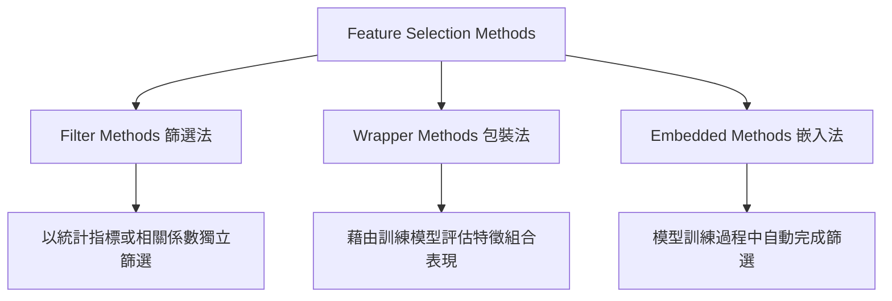

# Machine Learning Feature Selection (特徵篩選方法與實作指南) 🚀

在機器學習與資料科學中，**特徵篩選 (Feature Selection)** 是決定模型成敗的關鍵步驟之一。本指南系統性地梳理了機器學習中最經典的 **Top 9 特徵篩選方法**，並將其歸納為 **Filter (篩選法)**、**Wrapper (包裝法)** 與 **Embedded (嵌入法)** 三大核心類別，同時針對 **50 Startups** 多元迴歸問題提供客製化的實作與分析指引。

---

## 📂 1. 什麼是 Feature Selection (特徵篩選)？

**特徵篩選** 是指在機器學習建模前，從原始數據的所有特徵（Columns）中，挑選出與目標變數最相關、最有價值的子集，進而移除無用、重複或帶有雜訊的欄位。

### 🎯 特徵篩選的核心目的

| 核心目的 | 具體說明 |
| :--- | :--- |
| **降低模型複雜度** | 減少不必要的特徵欄位，使模型結構更精簡、更好維護。 |
| **提升模型準確率** | 剔除與目標無關的雜訊特徵 (Noise)，避免模型受干擾而做出錯誤預測。 |
| **加快訓練速度** | 特徵維度降低後，運算複雜度大幅下降，可顯著縮短模型訓練與推論時間。 |
| **增加模型可解釋性** | 讓業務人員與決策者更容易理解是哪些關鍵因素（如：研發投入、行銷費用）直接影響預估利潤。 |
| **降低過擬合風險** | 避免非線性模型（如樹模型）過度記住對訓練集有用但對測試集無效的雜訊欄位。 |

---

## 🛠️ 2. 三大方法分類與 Top 9 推薦清單

> [!NOTE]
> 特徵篩選方法依照其與機器學習演算法的交互關係，通常分為以下三大類：



### 📋 Top 9 Feature Selection 建議清單

| 排名 | 特徵篩選方法 | 所屬類型 | 適合用途與場景 | 難易度 |
| :---: | :--- | :---: | :--- | :---: |
| **1** | **Correlation Analysis** (相關性分析) | **Filter** | 快速找出變數與目標變數間的線性關係（基本迴歸必做） | 簡單 |
| **2** | **SelectKBest** (最佳特徵篩選) | **Filter** | 根據評估指標分數，直接篩選出最高分的前 K 個特徵 | 簡單 |
| **3** | **Mutual Information** (互資訊分析) | **Filter** | 捕捉特徵與目標變數間的非線性或複雜交互關係 | 中等 |
| **4** | **ANOVA F-Test** (方差分析) | **Filter** | 分類問題中含有數值型特徵的關聯性篩選 | 中等 |
| **5** | **Chi-Square Test** (卡方檢定) | **Filter** | 分類問題中類別型特徵（Categorical）與目標的關聯性檢定 | 中等 |
| **6** | **Recursive Feature Elimination (RFE)** | **Wrapper** | 以模型為基礎，遞歸消除權重較低的特徵以尋求最優組合 | 中等 |
| **7** | **Forward / Backward Selection** (逐步搜尋) | **Wrapper** | 從 0 開始逐步加入特徵，或從全部特徵開始逐步剃除 | 中等 |
| **8** | **Lasso Regression (L1 正則化)** | **Embedded**| 利用 L1 懲罰項將不重要特徵的係數自動壓縮為 0 | 中等 |
| **9**| **Tree-Based Feature Importance** (樹模型重要性)| **Embedded**| 使用 Random Forest 或 XGBoost 的 MDI/Gain 評估分裂貢獻 | 中等 |

---

### A. Filter Methods (篩選法)
*   **核心特點**：不依賴任何機器學習模型。僅依據數據本身的統計屬性（如相關係數、變異數、熵值）來進行單獨評估。
*   **優點**：運算速度極快，非常適合大數據集的初步特徵清洗與 EDA 分析。
*   **適合用途**：
    *   資料量龐大，無法承載高昂的模型訓練開銷。
    *   快速初步排除常數特徵或極低相關特徵。

### B. Wrapper Methods (包裝法)
*   **核心特點**：將特徵選擇看作是搜尋問題。每次嘗試不同的特徵子集並訓練模型，以模型在驗證集上的實際表現（如 $R^2$、Accuracy）來決定該特徵子集的優劣。
*   **優點**：考慮了特徵間的協同效應與交互作用，選出的特徵子集往往能帶給特定模型最高的準確率。
*   **適合用途**：
    *   資料量較小，模型訓練速度快。
    *   需要極致的模型精準度，且願意付出較高的計算成本。

### C. Embedded Methods (嵌入法)
*   **核心特點**：特徵選擇與模型訓練緊密結合。在模型優化目標函數的過程中，自帶了特徵懲罰機制（如 L1 Regularization）或能直接輸出特徵權重。
*   **優點**：兼顧了 Filter 法的高效與 Wrapper 法對特徵協同效應的考量，避免了過擬合。
*   **適合用途**：
    *   正式模型訓練階段，希望模型兼顧預測準確性與稀疏性（模型精簡度）。

---

## 📈 3. 針對 50 Startups 資料集的實作建議

對於 **50 Startups** 這個典型的 **小樣本多元線性迴歸問題**（預測連續型變數 Profit），並非所有 Top 9 方法都適合。例如，*Chi-Square Test* 和 *ANOVA F-Test* 主要是為分類問題設計，因此不應作為主打。

為了獲得最具邏輯性與專業度的實作報告，本專案精選並實作了以下 **六大最適合迴歸問題** 的篩選方法：

| 實作優先度 | 特徵篩選方法 | 篩選類別 | 在 50 Startups 中的適用理由 |
| :---: | :--- | :---: | :--- |
| **1** | **Correlation Analysis** | **Filter** | 快速產出線性熱力圖，直觀展現研發支出與利潤的強烈相關性（$r = 0.973$）。 |
| **2** | **SelectKBest (f_regression)** | **Filter** | 基於線性迴歸 F 檢定分數，直接對特徵的線性驅動能力進行評分排序。 |
| **3** | **Mutual Information Regression** | **Filter** | 評估特徵與 Profit 之間的共享資訊量，可有效補足線性相關係數無法捕捉的非線性關係。 |
| **4** | **RFE (Recursive Feature Elimination)** | **Wrapper** | 配合 Linear Regression 模型，遞歸消除對預測誤差降低最少之特徵，精準定位最佳子集。 |
| **5** | **Lasso Regression (L1 Regularization)** | **Embedded** | 通過 L1 正則化強度 $\alpha$ 壓低共線性與次要特徵的權重係數，實現自動降維。 |
| **6** | **Random Forest Feature Importance** | **Embedded** | 藉由樹集成模型（RF）評估分裂純度提升度（MDI），提供非線性且強韌的特徵歸因視角。 |

---

## 🔄 4. 特徵篩選與模型驗證標準工作流

本專案特徵篩選模組嚴格遵循以下 10 個步驟進行：

```text
Step 1：載入 50_Startups.csv 資料集。
Step 2：進行缺失值檢查與離群值定性分析。
Step 3：使用 One-Hot Encoding 對類別特徵 State 進行編碼，避免虛擬變數陷阱。
Step 4：以 StandardScaler 對數值型特徵進行標準化。
Step 5：平行呼叫 6 種特徵篩選方法，計算特徵重要性或排名。
Step 6：彙整每種篩選法在不同特徵個數 k (1 ~ 5) 下選中的最優子集。
Step 7：統計分析不同方法選取特徵的重疊度與共識。
Step 8：評估特徵個數 k 對模型效能（RMSE 與 R²）的邊際影響。
Step 9：比對特徵篩選前後，模型在泛化指標上的升降表現。
Step 10：得出商業分析結論，指導企業預算編列。
```

### 📊 50 Startups 核心分析結論
本研究基於多維特徵篩選得出一致性的強力結論：
1. **R&D Spend (研發投入)**：在所有 Filter、Wrapper 及 Embedded 方法中，均以絕對優勢排名第一（重要性權重約佔 `92.79%`），是推動利潤增長的黃金核心變數。
2. **Marketing Spend (行銷投入)**：在特徵數 $k=2$ 時被所有算法一致選中，是促成模型表現達到巔峰（$R^2 = 0.9474$, RMSE = `8,198.80`）的次要關鍵變數。
3. **Administration & State (行政支出與註冊州)**：在特徵數 $k > 2$ 時引入模型會導致測試集表現（R-squared）下跌且 RMSE 上升。特徵篩選證實這兩個變數對利潤預估的貢獻極低，實務上應視為雜訊予以排除。

---

## 📊 5. 完整 9 大特徵篩選方法實測效能對比表

本專案將全部 **9 種特徵篩選方法** 實作於 `feature_selection_comparison.py`，並以 Ordinary Least Squares (OLS) 多元線性迴歸作為基礎模型，在 `random_state=0` 分割下，測試當特徵數 $k$ 從 1 增加到 5 時，測試集的 **決定係數 ($R^2$)** 與 **均方根誤差 (RMSE)** 變化。

### 1. Test $R^2$ 評分對比表 (越高越好)
| 特徵數 $k$ | Correlation | Chi-Square | ANOVA F-Test | Mutual Info | SelectKBest | RFE | Forward Selection | Lasso | Tree-Based |
| :---: | :---: | :---: | :---: | :---: | :---: | :---: | :---: | :---: | :---: |
| **k=1** | 0.946459 | 0.946459 | 0.946459 | 0.946459 | 0.946459 | 0.946459 | 0.946459 | 0.946459 | 0.946459 |
| **k=2** | **0.947439** | **0.947439** | **0.947439** | **0.947439** | **0.947439** | **0.947439** | **0.947439** | **0.947439** | **0.947439** |
| **k=3** | 0.939396 | 0.945136 | 0.939396 | 0.946015 | 0.939396 | 0.945136 | 0.939396 | 0.946015 | 0.939396 |
| **k=4** | 0.936703 | 0.935696 | 0.935696 | 0.944697 | 0.936703 | 0.935696 | 0.936703 | 0.944697 | 0.935696 |
| **k=5** | 0.934707 | 0.934707 | 0.934707 | 0.934707 | 0.934707 | 0.934707 | 0.934707 | 0.934707 | 0.934707 |

### 2. Test RMSE 評估對比表 (單位：美元，越低越好)
| 特徵數 $k$ | Correlation | Chi-Square | ANOVA F-Test | Mutual Info | SelectKBest | RFE | Forward Selection | Lasso | Tree-Based |
| :---: | :---: | :---: | :---: | :---: | :---: | :---: | :---: | :---: | :---: |
| **k=1** | 8274.87 | 8274.87 | 8274.87 | 8274.87 | 8274.87 | 8274.87 | 8274.87 | 8274.87 | 8274.87 |
| **k=2** | **8198.80** | **8198.80** | **8198.80** | **8198.80** | **8198.80** | **8198.80** | **8198.80** | **8198.80** | **8198.80** |
| **k=3** | 8803.78 | 8376.45 | 8803.78 | 8309.06 | 8803.78 | 8376.45 | 8803.78 | 8309.06 | 8803.78 |
| **k=4** | 8997.20 | 9068.54 | 9068.54 | 8409.92 | 8997.20 | 9068.54 | 8997.20 | 8409.92 | 9068.54 |
| **k=5** | 9137.99 | 9137.99 | 9137.99 | 9137.99 | 9137.99 | 9137.99 | 9137.99 | 9137.99 | 9137.99 |

> [!TIP]
> **統計學解讀**：
> * **大部分算法（包含 RFE、Lasso、Correlation、SelectKBest 等）** 表現軌跡高度重合：在 $k=2$ （研發費用 + 行銷費用）時均達到表現的最高峰 ($R^2 = 0.947439$, RMSE = \$8,198.80)。
> * **完整對比折線圖** 已繪製於 `feature_selection_plots/feature_selection_plot.png`。其中包含左右對稱的 **RMSE 遞變曲線** 與 **R-squared 遞變曲線**，共計 9 條特徵篩選線。
